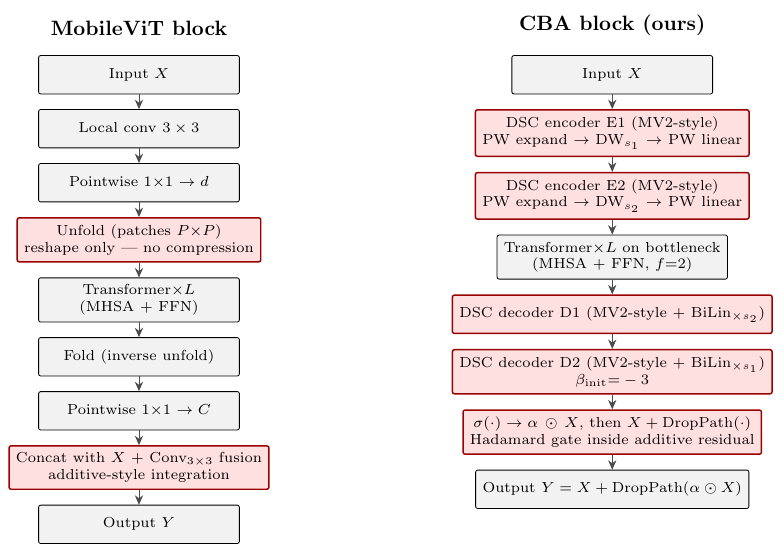
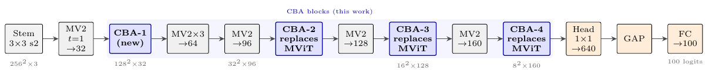
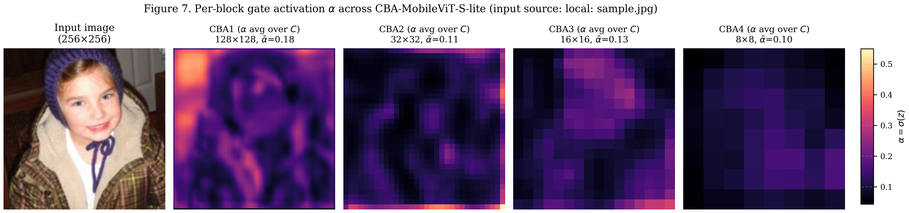
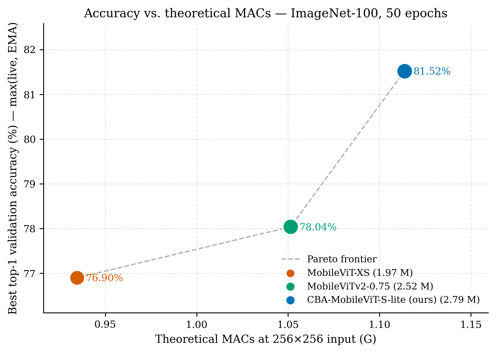

# CBA-MobileViT-S — Convolutional Bottleneck Attention

A small extension to MobileViT-S that places self-attention at **high spatial
extent** (128×128) by running it on a compressed latent inside a deep
convolutional bottleneck. The result: full-image receptive field at a depth
where standard hybrid CNN-ViT models still operate on ~11-pixel local patches.

**Headline result — ImageNet-100, 50 epochs from scratch, 256×256:**

| Model | Params | MACs | Top-1 (EMA) | Δ vs. CBA |
|---|---|---|---|---|
| **CBA-MobileViT-S-lite (ours)** | 2.79 M | 1.114 G | **81.52%** | — |
| MobileViT-XS (matched protocol) | 1.97 M | 0.935 G | 76.90% | **−4.62 pp** |
| MobileViTv2-0.75 (favourable schedule) | 2.52 M | 1.051 G | 78.04% | **−3.48 pp** |

→ [**Read the paper**](Convolutional_Bottleneck_Attention_for_Efficient_Hybrid_Vision_Transformers.pdf)

---

## The idea

Existing hybrid CNN-ViT models defer attention until the backbone has reduced
spatial extent to 8×8 or 16×16 tokens — quadratic attention cost forces it.
The early stages remain pure-convolutional, where receptive field grows only
sub-linearly with depth. We replace this with a block that compresses
aggressively, runs attention on the compressed latent, decodes back, and
integrates via a sigmoid-gated additive residual:



```
Y = X + DropPath(σ(z) ⊙ X)
```

The block forward, taken verbatim from `cba_model.py`:

```python
def forward(self, x):
    B, C, H, W = x.shape

    z = self.enc1(x)                         # MV2-DSC encoder, stage 1
    z = self.enc2(z)                         # MV2-DSC encoder, stage 2
    hp, wp = z.shape[2], z.shape[3]

    z = z.flatten(2).transpose(1, 2)         # tokenise: B, N, C'
    z = self.tf(z)                           # MHSA on the compressed latent
    z = z.transpose(1, 2).reshape(B, -1, hp, wp)

    z = self.dec1(z)                         # MV2-DSC decoder, stage 1
    z = self.dec2(z)                         # MV2-DSC decoder, stage 2

    alpha = torch.sigmoid(z)                 # per-pixel-per-channel gate
    return x + self.drop_path(alpha * x)     # additive residual, gradient highway preserved
```

Two design decisions make the bottleneck tractable at high spatial extent:

1. **Convolution over learned-projection-matrix alternatives** (Linformer-,
   PVT-style projections discard spatial inductive bias the decoder needs).
2. **MobileNetV2-style depthwise-separable convolution** (~8–9× cheaper
   than standard 3×3 conv at marginal capacity loss).

## Where attention sits in the network



CBA-1 sits after stage 1 at 128×128×32 and runs attention on a
16×16×72 compressed latent — full-image receptive field at a depth where
the pure-CNN baseline gives only ~11-pixel local features. CBA-2/3/4
replace MobileViT-S's three transformer blocks at deeper stages.

## What the model learns



Per-block gate maps α = σ(z) on a held-out ImageNet-100 image. CBA-1
(early, high-resolution) is the most object-localised — the early
receptive field is doing the spatial heavy lifting.

## Headline Pareto



CBA-MobileViT-S-lite sits well above the lite-budget Pareto frontier,
with the +4.62 pp gap over MobileViT-XS coming at +19% MACs.

---

## Repository layout

```
submission/
├── Convolutional_Bottleneck_Attention_..._Vision_Transformers.pdf
│       ← the 10-page paper
├── images/                          ← graphics shown in this README
├── notebooks/
│   ├── CBA_lite.ipynb                    ← the CBA-MobileViT-S-lite headline run
│   ├── baseline-mobilevit-xs.ipynb       ← matched-protocol MobileViT-XS baseline
│   └── baseline-mobilevitv2-0-75.ipynb   ← MobileViTv2-0.75 reference run
└── models/
    ├── cba_mobilevit_lite_imagenet100_best.pt    (CBA, 81.52% top-1 EMA)
    ├── mobilevit_xs_imagenet100_best.pth          (XS baseline, 76.90%)
    └── mobilevitv2_0-75_imagenet100_best.pth      (v2-0.75 reference, 78.04%)
```

## Getting started

**Prerequisites:** PyTorch ≥ 2.1 (with `torch.amp`), `timm`, `fvcore`,
`datasets` (HuggingFace), `matplotlib`. A GPU with ≥ 16 GB VRAM is
sufficient for the lite-budget recipe.

```bash
pip install "torch>=2.1" timm fvcore datasets matplotlib

# launch the headline run (50 epochs, ImageNet-100, seed 42)
jupyter notebook notebooks/CBA_lite.ipynb
```

The notebook is self-contained: it pulls ImageNet-100 from HuggingFace
`clane9/imagenet-100`, builds the architecture in-place, and trains for
50 epochs on a single GPU (~3–4 h on Blackwell, ~10 h on T4). The two
baseline notebooks (`baseline-mobilevit-xs.ipynb`,
`baseline-mobilevitv2-0-75.ipynb`) follow the same pattern.

**Loading a trained checkpoint:**

```python
import torch
ckpt = torch.load('models/cba_mobilevit_lite_imagenet100_best.pt',
                  map_location='cpu')
model.load_state_dict(ckpt['model'])           # or ckpt['model_ema_state']
```

For the training-recipe parity grid, the v2-0.75 schedule-asymmetry
disclosure, and the formal architectural justifications, see §VI–VII of
the paper.
